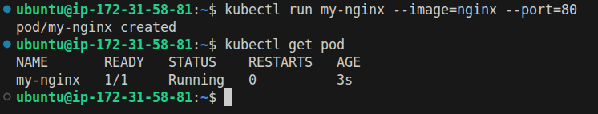
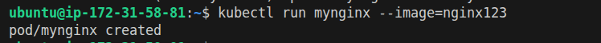
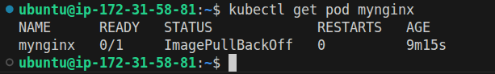
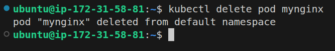
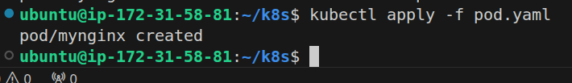
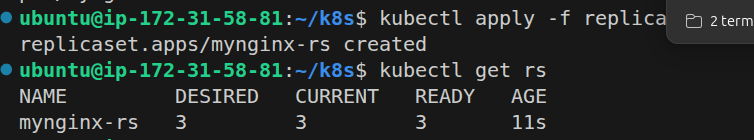
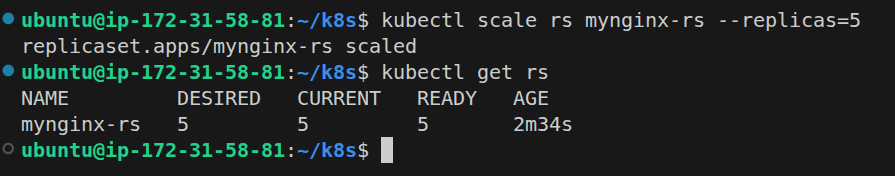
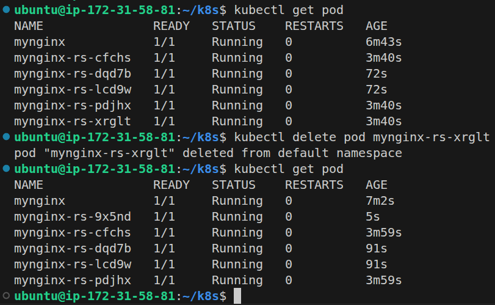
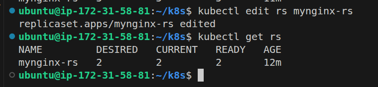
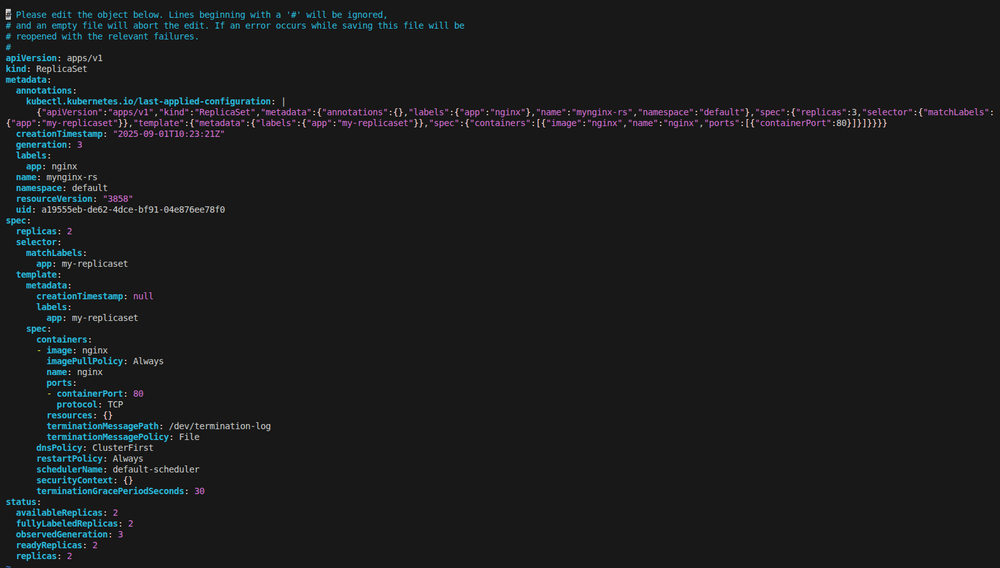

# k8s task lec2 answer
## Part1:

### 1- create pod nginx with name my nginx direct from command don't use yaml file

  - **explaination:** create pod with name of my-nginx
  - **command** :

        kubectl run my-nginx --image=nginx
  - **output of command** :

        pod/my-nginx created
    
  - **Screenshot** :
    
    
---
        
### 2- create pod nginx with name my nginx command and use Image nginx123  direct from command don't use yaml file

  - **explaination:** create pod with name of my-nginx using image called nginx123
  - **command** :

        kubectl run mynginx --image=nginx123
  - **output of command** :

        pod/mynginx created
    
  - **Screenshot** :
    
    
---
### 3- check the status and why it doesn't work 

  - **explaination:** can't find nginx123 on Docker hub
  - **command** :

        kubectl get pod mynginx
  - **output of command** :

        NAME      READY   STATUS             RESTARTS   AGE
        mynginx   0/1     ImagePullBackOff   0          9m15s
    
  - **Screenshot** :
    
    
---
### 4- I need to know node name - IP - Image Of the POD

  - **explaination:** get info about node name - IP - Image Of the POD
  - **command** :

        kubectl describe pod mynginx
  - **output of command** :

        Name:             mynginx
        Namespace:        default
        Priority:         0
        Service Account:  default
        Node:             minikube/192.168.49.2
        Start Time:       Mon, 01 Sep 2025 09:58:33 +0000
        Labels:           run=mynginx
        Annotations:      <none>
        Status:           Pending
        IP:               10.244.0.6
        IPs:
          IP:  10.244.0.6
        Containers:
          mynginx:
            Container ID:   
            Image:          nginx123
            Image ID:       
            Port:           <none>
            Host Port:      <none>
            State:          Waiting
              Reason:       ImagePullBackOff
            Ready:          False
            Restart Count:  0
            Environment:    <none>
            Mounts:
              /var/run/secrets/kubernetes.io/serviceaccount from kube-api-access-qrsfn (ro)
        Conditions:
          Type                        Status
          PodReadyToStartContainers   True 
          Initialized                 True 
          Ready                       False 
          ContainersReady             False 
          PodScheduled                True 
        Volumes:
          kube-api-access-qrsfn:
            Type:                    Projected (a volume that contains injected data from multiple sources)
            TokenExpirationSeconds:  3607
            ConfigMapName:           kube-root-ca.crt
            Optional:                false
            DownwardAPI:             true
        QoS Class:                   BestEffort
        Node-Selectors:              <none>
        Tolerations:                 node.kubernetes.io/not-ready:NoExecute op=Exists for 300s
                                     node.kubernetes.io/unreachable:NoExecute op=Exists for 300s
        Events:
          Type     Reason     Age                   From               Message
          ----     ------     ----                  ----               -------
          Normal   Scheduled  13m                   default-scheduler  Successfully assigned default/mynginx to minikube
          Normal   Pulling    10m (x5 over 13m)     kubelet            Pulling image "nginx123"
          Warning  Failed     10m (x5 over 13m)     kubelet            Failed to pull image "nginx123": Error response from daemon: pull access denied for nginx123, repository does not exist or may require 'docker login': denied: requested access to the resource is denied
          Warning  Failed     10m (x5 over 13m)     kubelet            Error: ErrImagePull
          Normal   BackOff    3m38s (x42 over 13m)  kubelet            Back-off pulling image "nginx123"
          Warning  Failed     3m38s (x42 over 13m)  kubelet            Error: ImagePullBackOff
    
---
### 5- delete the pod 

  - **explaination:** delete the pod 
  - **command** : 

        kubectl delete pod mynginx
  - **output of command** :

        pod "mynginx" deleted from default namespace
    
  - **Screenshot** :
    
    
---
### 6- create another one with yaml file and use label

  - **explaination:** create a pod in yaml file
  - **command** :

        kubectl apply -f pod.yaml
  - **output of command** :

        pod/mynginx created
    
  - **Screenshot** :
    
    
---
### 7-create Riplicaset with 3 replicas using nginx Image 

  - **explaination:** create Riplicaset with 3 replicas using nginx Image
  - **command** :

        kubectl apply -f replica.yaml
  - **output of command** :

        replicaset.apps/mynginx-rs created
    
  - **Screenshot** :
    
    
---
### 8-scale the replicas to 5 without edit in the Yaml file
 
  - **explaination:** scale the replicas to 5 without edit in the Yaml file
  - **command** :

        kubectl scale rs mynginx-rs --replicas=5
  - **output of command** :

        replicaset.apps/mynginx-rs scaled
    
  - **Screenshot** :
    
    
---
### 9-Delete any one of the 5 pods and check what happen and explain 

  - **explaination:** when we delete one of the pods of replicas, replicaset will create another pod because replica does self healing
  - **command** :

        kubectl delete pod mynginx-rs-xrglt
  - **output of command** :

        pod "mynginx-rs-xrglt" deleted from default namespace
    
  - **Screenshot** :
    
    
---
10-Scale down the pods aging to 2 without scale command use terminal  

  - **explaination:** Scale down the pods aging to 2 without scale command use terminal
  - **command** :

        kubectl edit rs mynginx-rs
  - **output of command** :

        replicaset.apps/mynginx-rs edited
    
  - **Screenshot** :
    
    
    
---
